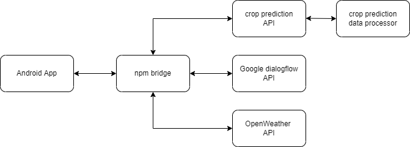
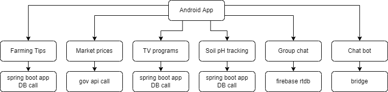

Hi 👋

This is my part of the work that I did in my College[bvm] for the last semester project.

Stuff you need to know before opening code:

* _admin-dashboard-backend_ sprint boot app crud app.
* _android-app_ react native android app.
* _bridge-npm_ kindoff application that routes api call here and there.
* _crop-price-prediction-api_ django backend app to provide crop price for the request that comes from _bridge-npm_.
* _crop-price-prediction-data_ place where I added code do extract crop data from gov websites.
* _tv-program-list-generator-selenium_ python code to get data from website that shows tv schedule.
* basic overview of bridge diagram:

 

 

* basic android screens overview diagram:

 

 

- checkout _youtube-video-urls.txt_ for project videos.